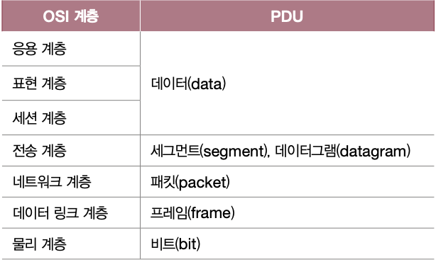

## Index

- 프로토콜
- 네트워크 참조 모델
- 캡슐화

## 프로토콜

: 노드 간에 정보를 올바르게 주고받기 위해 합의된 규칙이나 방법

- 서로 다른 통신 장치들이 정보를 주고받으려면 프로토콜이 통해야 함
- ex) IP, ARP, HTTPS, HTTP, TCP, UDP
- 모든 프로토콜에는 각 목적과 특징이 있음

## 네트워크 참조 모델

: 통신이 일어나는 각 과정을 계층으로 나눈 구조

- Why 통신과정을 계층으로 나눴을까?
  1. 네트워크 구성과 설계의 용이성
  - 각 계청의 목적에 부합하는 프로토콜과 네트워크 장비를 사용할 수 있음
  2. 네트워크 문제 진단과 해결의 용이성

### 대표 모델

#### 1. OSI 모델

- 국제 표준화 기구에서 만듬
- 7개의 계층으로 나뉨
  1. 물리계층
  - 통신 매체에 맞는 신호로 운반되도록 비트 데이터의 변환이 이루어지고 통신 매체를 통한 송수신이 이루어지는 계층
  2. 데이터 링크 계층
  - 네트워크 내 주변 장치 간의 정보를 올바르게 주고받기 위함
  - 물리 계층을 통해 주고받는 정보에 오류가 없는 지확인
  - 때로 전송 과정에서 발생할 수 있는 충돌 문제 해결
  3. 네트워크 계층
  - 메세지를 다른 네트워크에 속한 수신지까지 전달하는 계층
  4. 전송 계층
  - 신뢰성 있고 안정성 있는 전송을 하기 위함
  5. 세션 계층
  - 세션을 관리하기 위함
  - 세션: 통신을 주고받는 호스트의 응용 프로그램 간 연결 상태를 의미
  6. 표현 계층
  - 사람 언어 -> 컴퓨터 언어 번역
  7. 응용 계층
  - 사용자가 이용할 응용 프로그램에 다양한 네트워크 서비스를 제공

#### 2. TCP/IP 모델

- 이상적 설계인 OSI 보다 '실용적 구현'에 가까움
- = 인터넷 프로토콜 스위트, 프로토콜 스택
- IP: Internet Protocol
- 4개의 계층으로 나뉨
  1. 네트워크 액세스 계층
  - = 링크 계층 or 네트워크 인터페이스 계층
  - OSI의 데이터 계층과 유사
  2. 인터넷 계층
  - OSI의 네트워크 계층과 유사
  3. 전송 계층
  - OSI의 전송 계층과 유사
  4. 응용 계층
  - OSI의 세션, 표현, 응용 계층을 합친 것과 유사

## 캡슐화와 역캡슐화

### 캡슐화

- : 송신 과정에서 헤더 및 트레일러를 추가해 나가는 과정
- incapsulation

### 역캡슐화

- 메세지를 수신할 때 캡슐화 과정에서 붙였던 헤더를 각 계층에서 확인한 뒤 제거
- decapsulation

## (+) PDU

: 각 계층에서 송수신되는 메시지의 단위

- protocol data unit
  
- 전송 계층 이하의 메시지를 구분하기 위함
