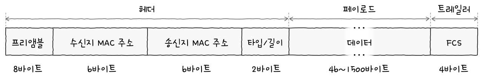

## Index

## 이더넷

- : 다양한 통신 매체의 규격들과 송수신되는 프레임의 형태, 프레임을 주고받는 방법 등이 정의된 네트워크 기술
- 현대 LAN, 유선 LAN 환경에서 가장 대중적인 기술

### 이더넷 표준

- IEEE 802.3 라는 이름으로 표준화
- 이더넷 표준에 따라 지원되는 네트워크 장비, 통신 매체의 종류와 전송 속도 등이 달라질 수 있음

### 통신 매체 표기 형태

- : {전송 속도}BASE-{추가특성}

1. 전송 속도 (data rate)

- 숫자만: Mbps
- 숫자+G: Gbps

2. BASE (BASEband)

- : 변조 타입(modulation type)을 의미
  - 변조 타입: 비트 신호로 변환된 데이터를 통신 매체로 전송하는 방법

3. 추가 특성 (additional distinction)

- ex)
  - 10BASE-{2} : 전송 가능한 최대 거리
  - 1000BASE-C{X} : 물리 계층 인코딩 방식
  - 100GBASE-L{R}4 : 비트 신호를 옮길 수 있는 전송로 수 (레인 수)

### 통신 매체 종류

| 추가 특성 표기 | 케이블 종류            |
| -------------- | ---------------------- |
| C              | 동축 케이블            |
| T              | 트위스티드 페어 케이블 |
| S              | 단파좡 광섬유 케이블   |
| L              | 장파장 광섬유 케이블   |

### 이더넷 프레임

- 이더넷 표준&통신 매체 / 이더넷 프레임 => related to 물리계층 / 데이터 링크 계층
- 

1. 프리앰블

- 송수신지 간의 동기화를 위함
- 첫7byte: 10101010 / 마지막byte: 10101011

2. 수신지 MAC 주소와 송신지 MAC 주소

- 네트워크 인터페이스마다 부여되는 6byte(48비트) 길이의 주소로 LAN 내의 수신지와 송신지를 특정할 수 있음
- "일반적으로" 고유하고, 변경되지 않는 주소

3. 타입/길이

- if 필드에 명시된 크기 <= 1500 : Length
- if 필드에 명시된 크기 >= 1536 : Type

4. 타입

- : 이더타입 - 이더넷 프레임이 '어떤 정보를 캡슐화했는지'
- 대표적으로 상위 계층에서 사용된 프로토콜의 이름이 명시됨

5. 데이터

- : 상위 계층에서 전달받거나 상위 계층으로 전달해야 할 내용
- 네트워크 계층의 데이터와 헤더를 합친 PDU가 포함
- 크기 제한 46byte <= 크기 <= 1500byte
  - if 크기 < 46byte : 패딩이라는 정보가 내부에 채워짐

6. FCS

- Frame Check Sequence: 수신한 이더넷 프레임에 오류가 있는지 확인
- CRC(Cyclic Redundancy Check) 순환 중복 검사라는 오류 검출용 값이 있음
